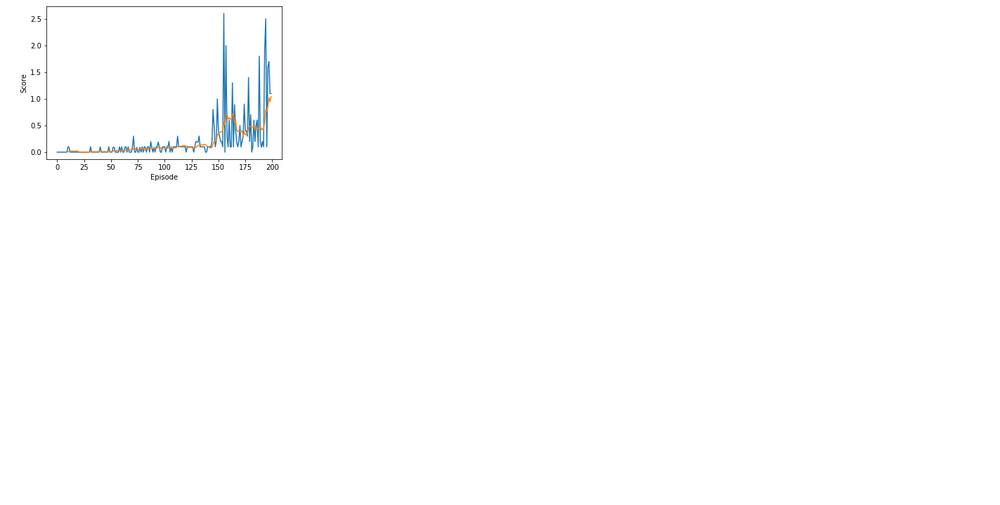

### Learning algorithm
Multi Agent Deep Deterministic Policy Gradient[(MADDPG)](https://arxiv.org/abs/1706.02275) algorithm was used for this training.<br>
DDPG applies actor-critic model-free policy gradient method for continuous spaces.<br>
The centralized critic with deterministic policies were effective in MADDPG.

### Hyper-parameters
```python
params = {
    'buffer_size': int(1e6),        # replay buffer size
    'batch_size': 128,              # minibatch size
    'seed': 0,                      # Seed to generate random numbers
    'gamma': 0.99,                      # discount factor
    'tau': 0.15,                        # for soft update of target parameters
    'update_every': 1,                  # update parameters per this number
    'lr_actor': 5e-4,                   # learning rate of the Actor
    'lr_critic': 3e-3,                  # learning rate of the Critic
    'seed': 42,                         # Seed to generate random numbers
    'actor_units': [512, 256],          # Number of nodes in hidden layers of the Actor
    'critic_units': [512, 256],         # Number of nodes in hidden layers of the Critic
    'weight_decay': 0,                  # L2 weight decay
    'noise_theta': 0.15,                # Theta of Ornstein-Uhlenbeck process
    'noise_sigma': 0.01,                # Sigma of Ornstein-Uhlenbeck process
}
```

I tried several learning rates for Actor and Critic.<br>
5e-4(lr of Actor) and 3e-3(lr of Critic) were best.<br>

Also, I tuned number of nodes in layers of Actor and Critic among [(512, 256), (256, 128)].<br>
(512, 256) seems to be beter.<br>

It did take quite long for me to find out that the Sigma of Ornstein-Uhlenbeck process was so critic to get a fast learning agent.<br>
0.01 was best for this environment.<br>
Similar for tau, i did start my search 1e-3 but it model did learn much only with much bigger tau, so  i did choose tau = 0.15 .

### Model architectures
There are two neural networks as the actor and the critic.

Batch normalization made a big improvement.

Leaky ReLU was used instead of ReLU for better performance.<br>

### Plot of Rewards


### Ideas for Future Work
1. In this project, only MADDPG was tested. Multi agent PPO/TRPO or other algorithms can be tested.
2. More complex model can be tested like 3 or more layers instead of 2 layers. Also, dropout could be applied.
